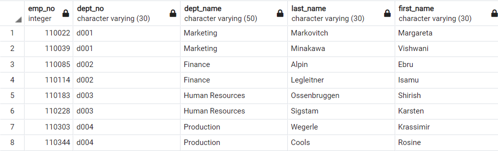
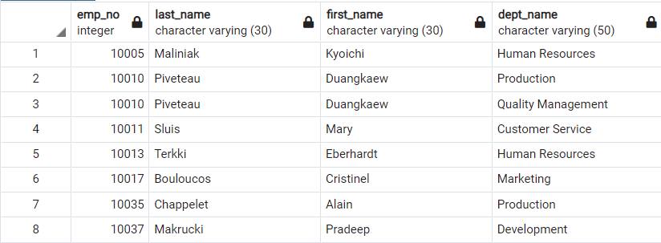
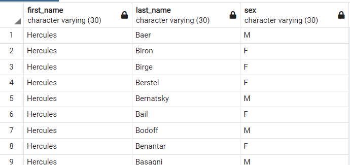
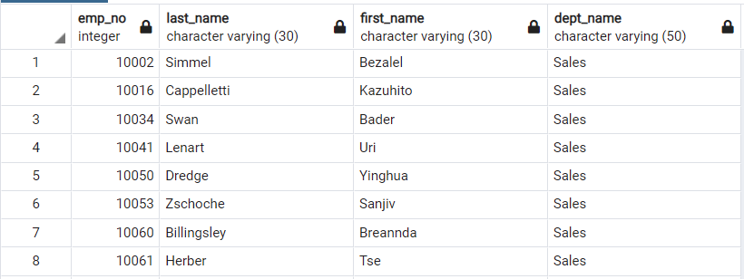
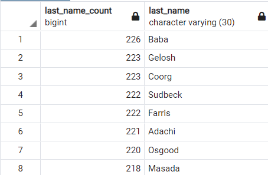

# SQL Homework - Employee Database: A Mystery in Two Parts


# Inside of this repository (Student Analysis)

The below is a breakdown (and instructions) for a SQL Homework Assignment required for the Data Science Bootcamp @ Northwestern University.

Students were to utilize PosGres to complete the assignment.  My finalized answers/results are outlined below

Github sql-challenge folder summary:

  * The data folder contains .csv files utilized for this exercise, which were imported into a database and ultimately individual schema/tables
  
  * The image folder contains all images created as part of the analysis

  * A schemas-tables.sxl file which creates the tables which ultimately are used to house our data
  
  * A query.sxl file which outlines the query scripting used to answer the questions outlined below in the assignment.  
  
  * An ERD.png file.  The Entity Relationship Diagram, or a diagram outlining the relationship mapping of the database, pictures below:

  

## Background

It is a beautiful spring day, and it is two weeks since you have been hired as a new data engineer at Pewlett Hackard. Your first major task is a research project on employees of the corporation from the 1980s and 1990s. All that remain of the database of employees from that period are six CSV files.

In this assignment, you will design the tables to hold data in the CSVs, import the CSVs into a SQL database, and answer questions about the data. In other words, you will perform:

1. Data Engineering

3. Data Analysis

Note: You may hear the term "Data Modeling" in place of "Data Engineering," but they are the same terms. Data Engineering is the more modern wording instead of Data Modeling.

### Before You Begin

1. Create a new repository for this project called `sql-challenge`. **Do not add this homework to an existing repository**.

2. Clone the new repository to your computer.

3. Inside your local git repository, create a directory for the SQL challenge. Use a folder name to correspond to the challenge: **EmployeeSQL**.

4. Add your files to this folder.

5. Push the above changes to GitHub.

## Instructions

#### Data Modeling

Inspect the CSVs and sketch out an ERD of the tables. Feel free to use a tool like [http://www.quickdatabasediagrams.com](http://www.quickdatabasediagrams.com).

#### Data Engineering

* Use the information you have to create a table schema for each of the six CSV files. Remember to specify data types, primary keys, foreign keys, and other constraints.

  * For the primary keys check to see if the column is unique, otherwise create a [composite key](https://en.wikipedia.org/wiki/Compound_key). Which takes to primary keys in order to uniquely identify a row.
  * Be sure to create tables in the correct order to handle foreign keys.

* Import each CSV file into the corresponding SQL table. **Note** be sure to import the data in the same order that the tables were created and account for the headers when importing to avoid errors.

#### Data Analysis

Once you have a complete database, do the following:

1. List the following details of each employee: employee number, last name, first name, sex, and salary.

query:  

		create view answer1 as
			select  employees.emp_no, employees.last_name, employees.first_name, employees.sex, salaries.salary
			from employees
			join salaries
				on (employees.emp_no = salaries.emp_no);
				
		select * from answer1;


2. List first name, last name, and hire date for employees who were hired in 1986.

query:  

		create view answer2 as
			select first_name, last_name, hire_date
			from employees 
			where hire_date >= '1986-01-01' 
			and hire_date < '1987-01-01'
			order by hire_date;

		select * from answer2;


3. List the manager of each department with the following information: department number, department name, the manager's employee number, last name, first name.

query:  

		create view answer3 as
			select department_manager.emp_no, department_manager.dept_no, departments.dept_name, employees.last_name, employees.first_name
			from departments 
			join department_manager 
			on (departments.dept_no= department_manager.dept_no)
				join employees
				on (department_manager.emp_no = employees.emp_no);
				
		select * from answer3;




4. List the department of each employee with the following information: employee number, last name, first name, and department name.

query:  

		create view answer4 as
			select employees.emp_no, employees.last_name, employees.first_name, departments.dept_name
			from employees 
			join department_employees
			on (department_employees.emp_no= employees.emp_no)
				join departments
				on (departments.dept_no = department_employees.dept_no);
				
		select * from answer4;




5. List first name, last name, and sex for employees whose first name is "Hercules" and last names begin with "B."

query:  

		create view answer5 as
			select employees.first_name, employees.last_name, employees.sex
			from employees 
			where employees.first_name = 'Hercules' and employees.last_name like 'B%';

		select * from answer5;




6. List all employees in the Sales department, including their employee number, last name, first name, and department name.

query:  

		create view answer6 as
			select employees.emp_no, employees.last_name, employees.first_name, departments.dept_name
			from departments 
			join department_employees
			on (department_employees.dept_no= departments.dept_no)
				join employees
				on (employees.emp_no = department_employees.emp_no)
				where departments.dept_name = 'Sales';

		select * from answer6;




7. List all employees in the Sales and Development departments, including their employee number, last name, first name, and department name.

query:  

		create view answer7 as
			select employees.emp_no, employees.last_name, employees.first_name, departments.dept_name
			from departments 
			join department_employees
			on (department_employees.dept_no= departments.dept_no)
				join employees
				on (employees.emp_no = department_employees.emp_no)
				where departments.dept_name = 'Sales' or departments.dept_name = 'Development';

		select * from answer7;


8. In descending order, list the frequency count of employee last names, i.e., how many employees share each last name.

query:  

		create view answer8 as
		select count(employees.last_name) as last_name_count, employees.last_name
			from employees
			group by last_name
			order by last_name_count DESC;

		select * from answer8;




## Bonus (Optional)

As you examine the data, you are overcome with a creeping suspicion that the dataset is fake. You surmise that your boss handed you spurious data in order to test the data engineering skills of a new employee. To confirm your hunch, you decide to take the following steps to generate a visualization of the data, with which you will confront your boss:

1. Import the SQL database into Pandas. (Yes, you could read the CSVs directly in Pandas, but you are, after all, trying to prove your technical mettle.) This step may require some research. Feel free to use the code below to get started. Be sure to make any necessary modifications for your username, password, host, port, and database name:

   ```sql
   from sqlalchemy import create_engine
   engine = create_engine('postgresql://localhost:5432/<your_db_name>')
   connection = engine.connect()
   ```

* Consult [SQLAlchemy documentation](https://docs.sqlalchemy.org/en/latest/core/engines.html#postgresql) for more information.

* If using a password, do not upload your password to your GitHub repository. See [https://www.youtube.com/watch?v=2uaTPmNvH0I](https://www.youtube.com/watch?v=2uaTPmNvH0I) and [https://help.github.com/en/github/using-git/ignoring-files](https://help.github.com/en/github/using-git/ignoring-files) for more information.

2. Create a histogram to visualize the most common salary ranges for employees.

3. Create a bar chart of average salary by title.

## Epilogue

Evidence in hand, you march into your boss's office and present the visualization. With a sly grin, your boss thanks you for your work. On your way out of the office, you hear the words, "Search your ID number." You look down at your badge to see that your employee ID number is 499942.

## Submission

* Create an image file of your ERD.

* Create a `.sql` file of your table schemata.

* Create a `.sql` file of your queries.

* (Optional) Create a Jupyter Notebook of the bonus analysis.

* Create and upload a repository with the above files to GitHub and post a link on BootCamp Spot.

* Ensure your repository has regular commits (i.e. 20+ commits) and a thorough README.md file

### Copyright

Trilogy Education Services © 2019. All Rights Reserved.
