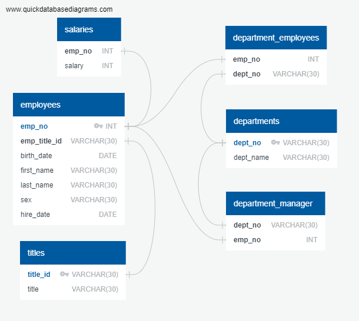
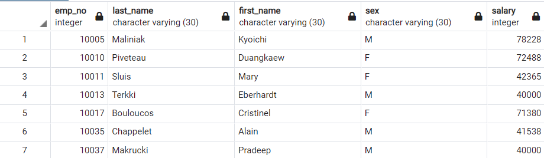
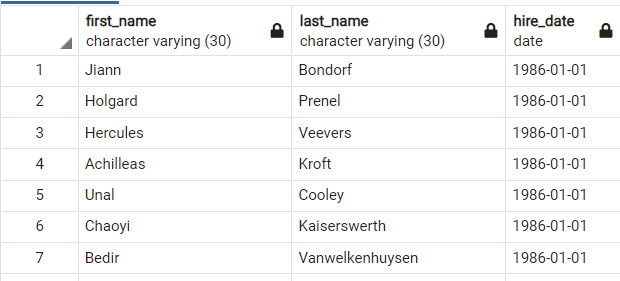
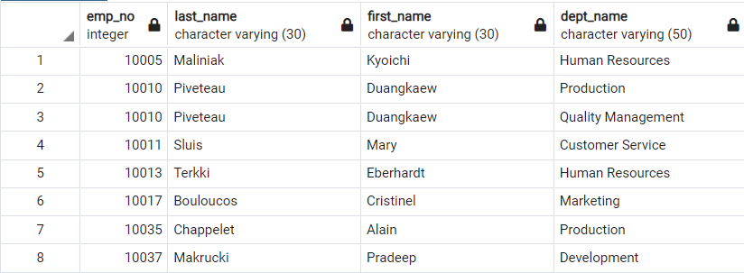
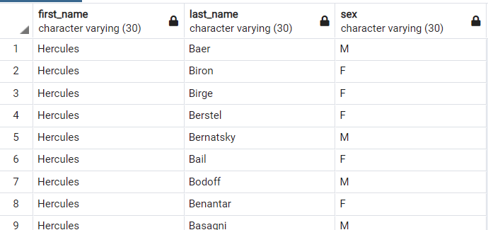
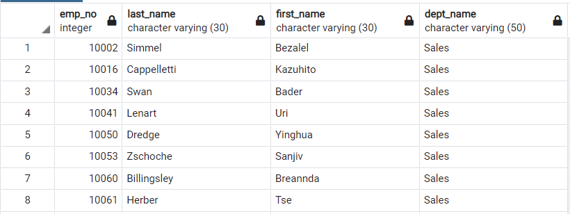
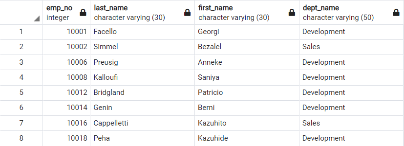
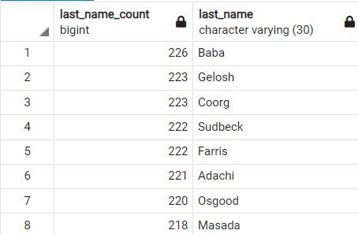

# Simulated SQL Project - Employee Database: Planning, Setting up, SQL Querying


<!-- TABLE OF CONTENTS -->
<details open="open">
  <summary>Table of Contents</summary>
  <ol>
    <li><a href="#about-the-project">About The Project</a></li>
    <li><a href="#the-scenario">The Scenario</a></li>
    <li><a href="#the-challenges">The Challenges</a></li>
	<li><a href="#data-modeling">Data Modeling</a></li>
    <li><a href="#data-engineering">Data Engineering</a></li>
    <li><a href="#data-analysis">Data Analysis</a></li>
    <li><a href="#inside-of-this-repository">Inside of thie Repository</a></li>
    <li><a href="#bonus">Bonus</a></li>
  </ol>
</details>

## About the Project  

The contents of this repository contain a simulated SQL Challenge, a part of the Data Science Bootcamp at Northwestern University curriculum. It includes setting up an ERD, creating a PostgreSQL database, and writing SQL Queries to answer specific questions.

## The Scenario  

It is a beautiful spring day, and it is two weeks since you have been hired as a new data engineer at Pewlett Hackard. Your first major task is a research project on employees of the corporation from the 1980s and 1990s. All that remain of the database of employees from that period are six CSV files.  

## The Challenges  

Design the tables to hold data in the CSVs, import the CSVs into a SQL database, and answer questions about the data. This includes:  

### 1. <a href="#data-modeling">Data Modeling</a> - Setting up an ERD.  I utilized: [http://www.quickdatabasediagrams.com](http://www.quickdatabasediagrams.com).  <br>

### 2. <a href="#data-engineering">Data Engineering</a> -  Create a table schema for each of the six CSV files.  Specify data types, primary keys, foreign keys, and other constraints. See schema-tables.sxl file for final results.  <br>

### 3. <a href="#data-analysis">Data Analysis</a> - Writing SQL Queries to answer various questions from your "employer".   <br>

## Data Modeling  

Entity Relationship Diagram: 

     
<br>

## Data Engineering - [Schemas-Tables Creation SQL File](schemas-tables.sql)    
<br>

## Data Analysis - [SQL Queries File](query.sql)    
<br>

1. List the following details of each employee: employee number, last name, first name, sex, and salary.

My query:  

		create view answer1 as
			select  employees.emp_no, employees.last_name, employees.first_name, employees.sex, salaries.salary
			from employees
			join salaries
				on (employees.emp_no = salaries.emp_no);
				
		select * from answer1;




2. List first name, last name, and hire date for employees who were hired in 1986.

My query:  

		create view answer2 as
			select first_name, last_name, hire_date
			from employees 
			where hire_date >= '1986-01-01' 
			and hire_date < '1987-01-01'
			order by hire_date;

		select * from answer2;




3. List the manager of each department with the following information: department number, department name, the manager's employee number, last name, first name.

My query:   

		create view answer3 as
			select department_manager.emp_no, department_manager.dept_no, departments.dept_name, employees.last_name, employees.first_name
			from departments 
			join department_manager 
			on (departments.dept_no= department_manager.dept_no)
				join employees
				on (department_manager.emp_no = employees.emp_no);
				
		select * from answer3;


4. List the department of each employee with the following information: employee number, last name, first name, and department name.

My query:  

		create view answer4 as
			select employees.emp_no, employees.last_name, employees.first_name, departments.dept_name
			from employees 
			join department_employees
			on (department_employees.emp_no= employees.emp_no)
				join departments
				on (departments.dept_no = department_employees.dept_no);
				
		select * from answer4;




5. List first name, last name, and sex for employees whose first name is "Hercules" and last names begin with "B."

My query:   

		create view answer5 as
			select employees.first_name, employees.last_name, employees.sex
			from employees 
			where employees.first_name = 'Hercules' and employees.last_name like 'B%';

		select * from answer5;




6. List all employees in the Sales department, including their employee number, last name, first name, and department name.

My query:  

		create view answer6 as
			select employees.emp_no, employees.last_name, employees.first_name, departments.dept_name
			from departments 
			join department_employees
			on (department_employees.dept_no= departments.dept_no)
				join employees
				on (employees.emp_no = department_employees.emp_no)
				where departments.dept_name = 'Sales';

		select * from answer6;




7. List all employees in the Sales and Development departments, including their employee number, last name, first name, and department name.

My query: 

		create view answer7 as
			select employees.emp_no, employees.last_name, employees.first_name, departments.dept_name
			from departments 
			join department_employees
			on (department_employees.dept_no= departments.dept_no)
				join employees
				on (employees.emp_no = department_employees.emp_no)
				where departments.dept_name = 'Sales' or departments.dept_name = 'Development';

		select * from answer7;




8. In descending order, list the frequency count of employee last names, i.e., how many employees share each last name.

My query:  

		create view answer8 as
		select count(employees.last_name) as last_name_count, employees.last_name
			from employees
			group by last_name
			order by last_name_count DESC;

		select * from answer8;





## Bonus (Optional)

As you examine the data, you are overcome with a creeping suspicion that the dataset is fake. You surmise that your boss handed you spurious data in order to test the data engineering skills of a new employee. To confirm your hunch, you decide to take the following steps to generate a visualization of the data, with which you will confront your boss:

1. Import the SQL database into Pandas. (Yes, you could read the CSVs directly in Pandas, but you are, after all, trying to prove your technical mettle.) This step may require some research. Feel free to use the code below to get started. Be sure to make any necessary modifications for your username, password, host, port, and database name:

   ```sql
   from sqlalchemy import create_engine
   engine = create_engine('postgresql://localhost:5432/<your_db_name>')
   connection = engine.connect()
   ```

* Consult [SQLAlchemy documentation](https://docs.sqlalchemy.org/en/latest/core/engines.html#postgresql) for more information.

* If using a password, do not upload your password to your GitHub repository. See [https://www.youtube.com/watch?v=2uaTPmNvH0I](https://www.youtube.com/watch?v=2uaTPmNvH0I) and [https://help.github.com/en/github/using-git/ignoring-files](https://help.github.com/en/github/using-git/ignoring-files) for more information.

2. Create a histogram to visualize the most common salary ranges for employees.

3. Create a bar chart of average salary by title.

## Inside of this Repository

Folder Summary:

  * The data folder contains .csv files utilized for this exercise, which were imported into a PostgreSQL Database and ultimately individual schema/tables
  
  * The image folder contains all images created as part of the analysis.

  * A schemas-tables.sxl file which I wrote to create the tables which house our data.
  
  * A query.sxl file which outlines the query scripting I wrote to answer the questions outlined in the assignment.  
  
  * An ERD.png file.  An Entity Relationship Diagram, which I created to outline the relationship mapping of the database.  This is below:

 